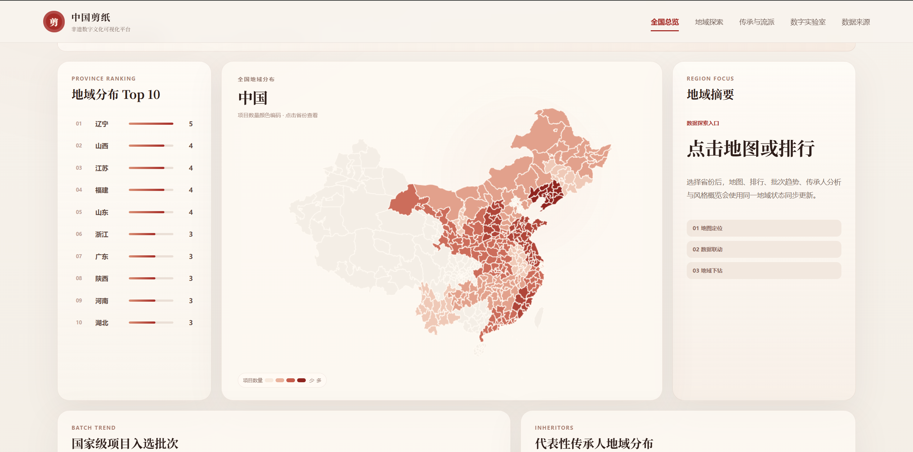
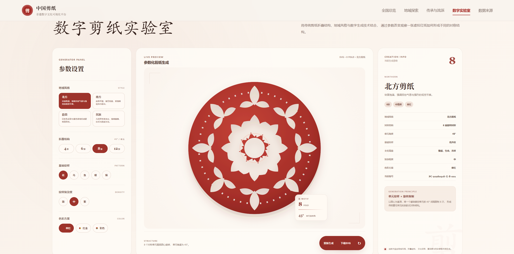

# 中国剪纸非遗数字文化可视化平台

中国剪纸非遗数字文化可视化平台是一个基于 **Vue 3 + TypeScript + ECharts + SVG** 开发的文化数据可视化项目。

项目围绕中国剪纸非物质文化遗产数据展开，通过地图可视化、数据分析、传承人展示以及数字剪纸交互实验等方式，将传统文化内容与现代 Web 技术结合，探索非遗文化的数字化展示方式。

> 项目主要用于前端工程实践、数据可视化探索以及个人作品展示。

---

# 在线演示

**在线地址：**

https://gielensras471-creator.github.io/paper-cutting-visualization/

**GitHub：**

https://github.com/gielensras471-creator/paper-cutting-visualization

---

# 项目展示

## 首页视觉设计

项目采用传统剪纸红色与米白色作为整体视觉基调，结合现代 Web 页面布局，构建具有文化特色的数据展示平台。

---

## 全国地域分布可视化

通过 ECharts Geo 地图实现中国剪纸非遗项目地域分布展示。

支持：

- 全国省份分布展示
- 项目数量映射
- 省份点击交互
- 地域数据联动展示

---

## 传承人档案展示

围绕国家级代表性传承人数据设计档案展示模块。

展示：

- 传承人信息
- 地域分布
- 项目关联
- 文化背景

---

## 数字剪纸生成器

基于 SVG 参数化生成方式，实现数字剪纸交互实验。

支持：

- 折数选择
- 纹样选择
- 色彩调整
- 对称结构生成

---

## 纹样分析实验

通过结构化方式展示剪纸中的典型纹样关系。

包含：

- 花纹
- 鸟纹
- 鱼纹
- 蝴蝶纹
- 云纹
- 福字等传统元素

---

# 项目预览

## 核心模块

- 全国剪纸非遗项目地域分布
- 省份数据探索
- 国家级代表性传承人展示
- 剪纸风格分析
- 数字剪纸生成实验
- SVG 参数化纹样生成
- 数据可视化展示
- 响应式页面布局

---

# 技术栈

| 技术 | 用途 |
| --- | --- |
| Vue 3 | 前端核心框架 |
| TypeScript | 类型约束与工程开发 |
| Vite | 项目构建工具 |
| Vue Router | 页面路由管理 |
| ECharts | 数据可视化图表 |
| SVG | 数字剪纸图形生成 |
| CSS3 | 页面视觉设计 |
| JavaScript | 交互逻辑实现 |
| pnpm | 包管理工具 |

---

# 功能介绍

## 1. 全国地域分布可视化

项目通过 ECharts 中国地图实现非遗项目地域展示。

主要功能：

- 中国地图渲染
- 省份数据绑定
- 项目数量颜色映射
- 点击省份查看详情

数据展示流程：
